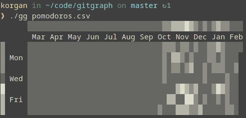

# gg: gitgraph
Generates a heatmap in the terminal that's similar to Github's contributions graph.

## Description
Given some csv file that contains timestamps and corresponding values, gg generates a heatmap similar to Github's contributions graph. I use this with the tss.log generated by [silvercheetah][1] to visualise my cycling workouts.

I've added a little something that github doesn't have to my graph; there's a heatmap down the left side that shows how active you are on particular days of the week. With this, it's easy to see when you workout hardest and when you might be slacking.

The graphics are UTF-8 characters that I'm just going to pretend are strings to avoid having to work with unicode in C. :octocat:

## Conky
I've added a conky script to the repo so you can have this:

## Notes
It might be more convenient if gg could accept piped data. Might do that later.

[1]: https://github.com/korganrivera/silvercheetah
